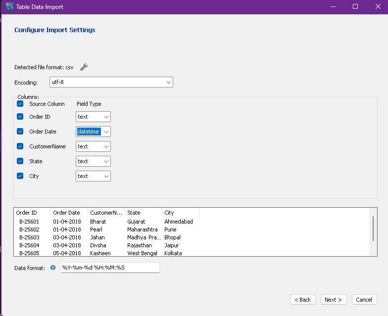
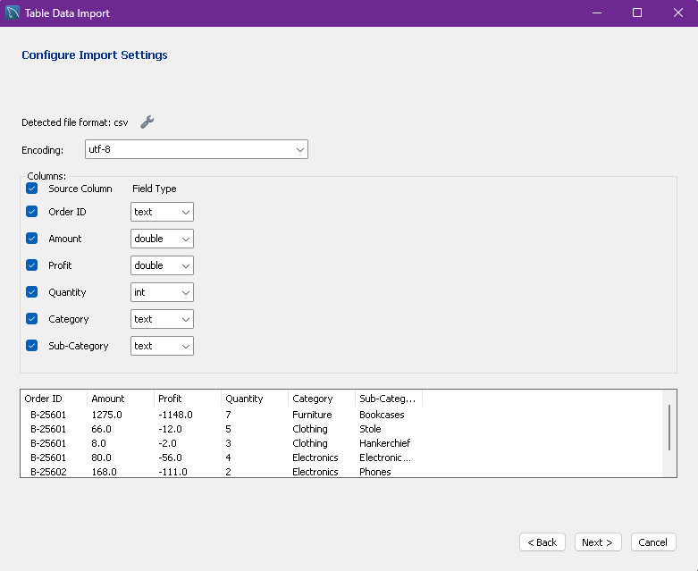
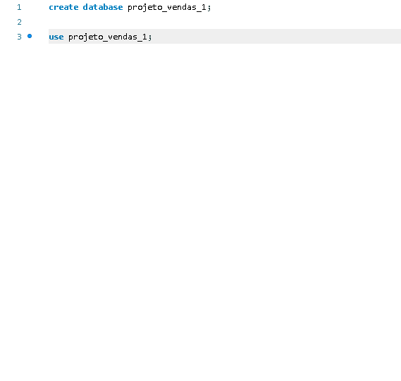
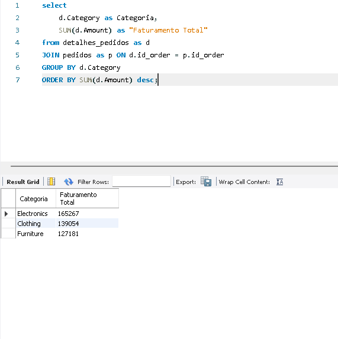
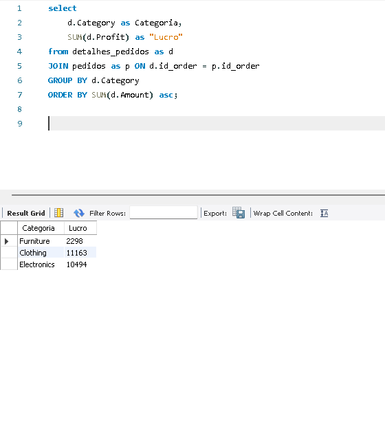
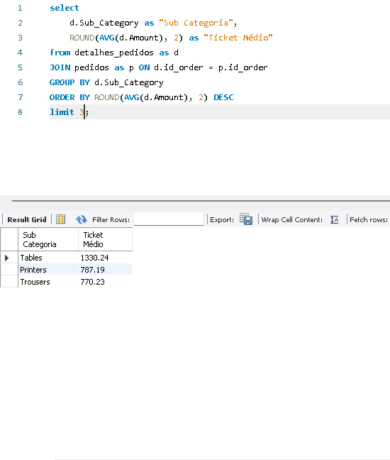
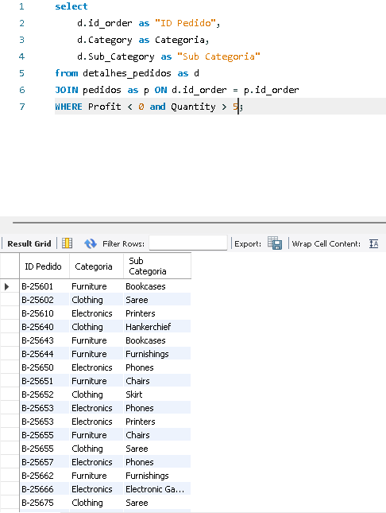
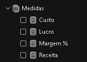
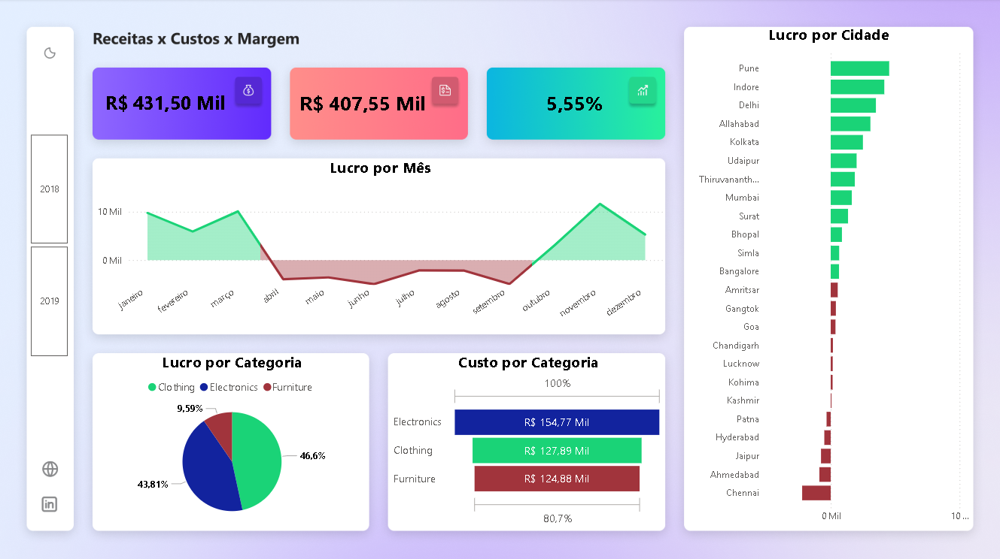

# 📊 Projeto End-to-End: Da Modelagem SQL ao Dashboard Estratégico

## 🎯 Objetivo do Projeto
Este projeto demonstra o **ciclo completo de um Analista de Dados**: desde a ingestão de dados brutos em um ambiente relacional, tratamento via consultas **SQL** para extração de métricas de negócio, até a visualização final e aplicação de **Data Storytelling** para suporte à decisão executiva.

---

## 🛠️ Etapa 1: Ingestão e Configuração (MySQL)
O processo iniciou-se com a estruturação do ambiente no **MySQL**. Realizei o mapeamento detalhado dos tipos de dados para garantir a integridade das informações durante a importação.

* **Ação:** Criação do Database e configuração técnica das colunas.
* **Foco:** Garantir que valores monetários e datas fossem lidos corretamente.

| Etapa | Descrição |
| :--- | :--- |
| **Configuração** | Definição de tipos (Double, Datetime, Text) |
| **Importação** | Carga dos arquivos CSV para as tabelas |
| **Validação** | Checagem de integridade da base |

---

## 🔍 Etapa 2: Exploração e Consultas SQL (Extração de Valor)
Com os dados carregados, utilizei o **SQL** para extrair indicadores chave (**KPIs**). Esta etapa valida as regras de negócio antes da visualização.

### 💰 **Análise de Faturamento**
Identificação do volume financeiro gerado por categoria de produto.

### 📈 **Análise de Lucratividade**
Foco em entender onde a operação é realmente rentável e gera valor líquido.

### 🎫 **Ticket Médio**
Cálculo do valor médio gasto por subcategoria para entender o perfil de consumo.

### ⚠️ **Identificação de Alertas (Prejuízo)**
Consulta avançada para filtrar pedidos com alta quantidade de itens que resultaram em prejuízo, visando identificar falhas operacionais.

---

## 📈 Etapa 3: Criação de Medidas Dax
Essa etapa criei medidas DAX para garantir que o Dashboard fosse dinâmico e seguisse as melhores práticas de mercado, desenvolvi as métricas fundamentais utilizando a linguagem **DAX (Data Analysis Expressions)**. O uso de medidas em vez de colunas calculadas garante maior performance ao relatório..

### **Principais Medidas:**
* **Lucro** 
* **Custo** 
* **Margem %** 
* **Receita**

## 📈 Etapa 4: Visualização e Storytelling (Power BI)
A etapa final foi a construção de um dashboard interativo focado em **UX (User Experience)** e **Storytelling**.

### **Principais Insights Visualizados:**
* **Margem de Lucro (5,55%):** Destaque imediato para a saúde financeira real.
* **Sazonalidade:** Gráfico de área destacando em **vermelho** o período de prejuízo (Abril a Setembro).
* **Regionalismo:** Identificação das cidades com maior e menor eficiência.
* **Mix de Custos:** Decomposição visual dos custos por categoria (*Electronics, Clothing, Furniture*).

---

## 🚀 Conclusão e Resultados
* **Diagnóstico:** Identificamos que cidades como Chennai e Ahmedabad operam no prejuízo, exigindo revisão logística.
* **Sazonalidade:** O negócio enfrenta desafios de fluxo de caixa no meio do ano.
* **Decisão:** O foco estratégico deve ser a otimização de custos na categoria de Eletrônicos para elevar a margem geral de 5,55%.

---

## ⚙️ Tecnologias Utilizadas
* **Banco de Dados:** MySQL
* **Linguagem:** SQL (CTEs, Joins, Aggregations)
* **Visualização:** Power BI (DAX, Data Modeling)
* **Conceito:** Business Intelligence & Data Storytelling

---
> **Status do Projeto:** Concluído ✅  
> **Área:** Análise de Dados / Business Intelligence
